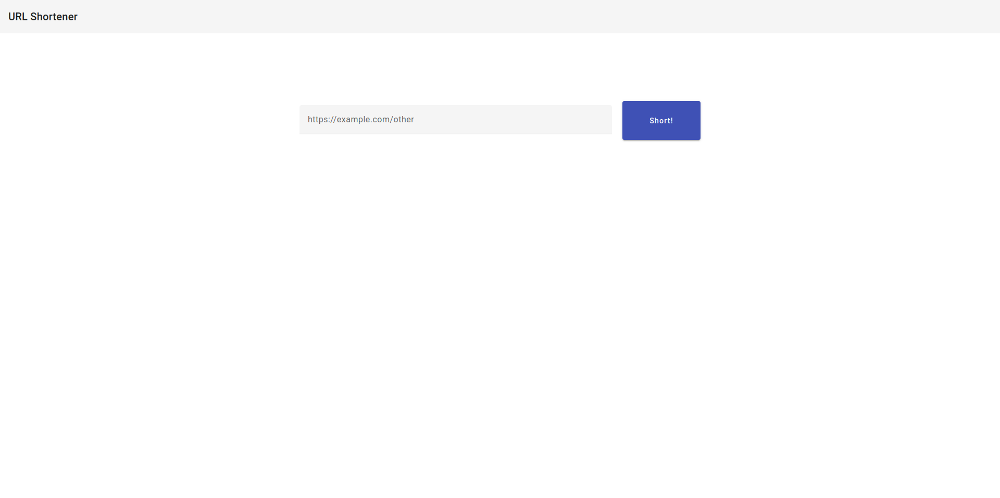
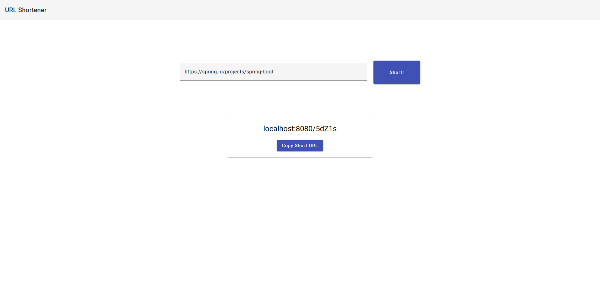
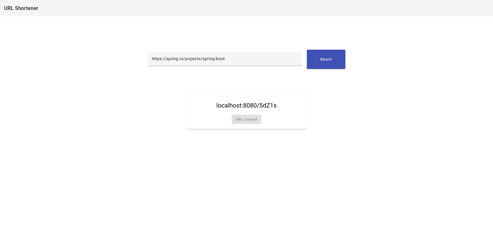

# URL SHORTENER  

<br>

## Screens

### Home


### After create a Link
 "After create a link")

### After copy the link created 


## 1. backend

- Init docker compose

```sh
#enter in api project
cd url-shortener-ui
# init postgres
docker-compose up
# init spring boot
./mvnw spring-boot:run
```

## 2. frontend

```sh
    # enter in ui project 
    cd url-shortener-ui
    # install the packages
    npm i
    # init server
    ng serve
```

[3. doc swagger](http://localhost:8080/swagger-ui/index.html)